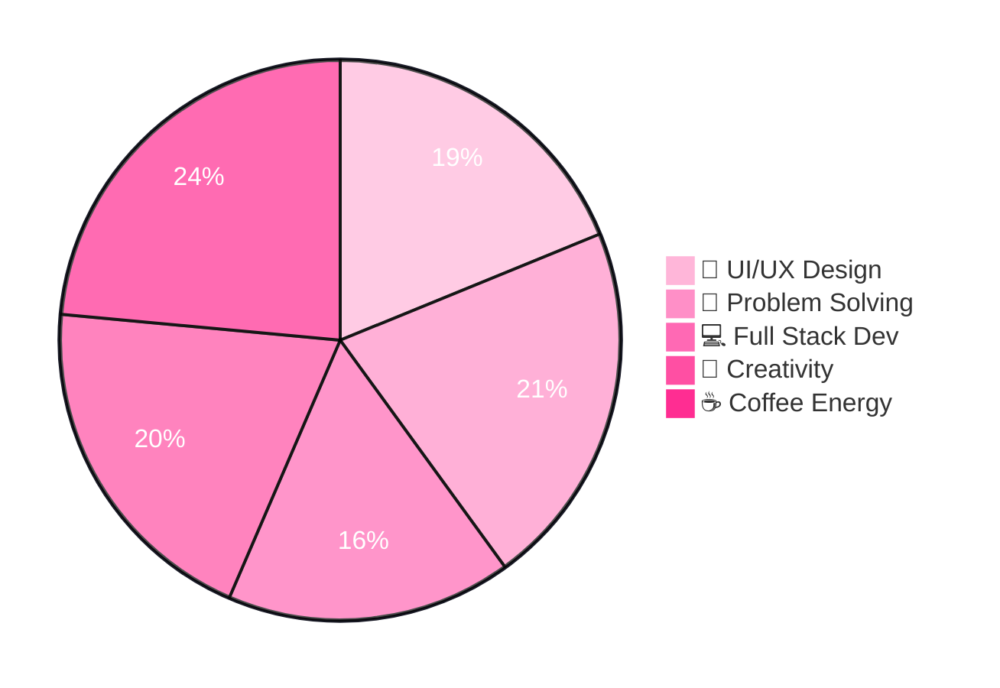

<div align="center">


<br>
<br/>


</div>


# 🌸 About Me


```js
const tejashree = {
  role: "Full-Stack Web Developer",
  education: "B.E Computer Engineering",
  university: "Gujarat Technological University",
  cgpa: "9.39",
  
  interests: [
    "Full Stack Development",
    "UI/UX Design",
    "SaaS Products",
    "Creative Frontend"
  ],

  achievements: [
    "🏆 2x Devang Mehta IT Award Winner",
    "🚀 Smart India Hackathon Participant"
  ],

  currentlyLearning: [
    "React",
    "Backend Development",
    "Modern SaaS Architecture"
  ]
};
```

- 🌸 Passionate about crafting beautiful digital experiences
- 🚀 Building scalable SaaS applications
- 🎨 Combining creativity with development
- 💡 Exploring modern web technologies
- ☕ Turning caffeine into code daily

<br clear="right"/>


# ⚡ Tech Arsenal

<div align="center">

<table>
<tr>
<td valign="top" width="50%">

### 🎨 Frontend & UI

<p align="center">


</p>

</td>

<td valign="top" width="50%">

### 🛠️ Tools & Platforms

<p align="center">


</p>

</td>
</tr>
</table>

<table>
<tr>
<td valign="top" width="50%">

### 🤖 AI & APIs

<p align="center">


</p>

</td>

<td valign="top" width="50%">

### 🚀 Currently Exploring

<p align="center">


</p>

</td>
</tr>
</table>

</div>

<br>


# 📊 GitHub Analytics

<div align="center">


</div>

<div align="center">


</div>

<div align="center">


</div>

<br>
<br>

# 🏆 Achievements

<div align="center">
<br>


</div>
<br>
<div align="center">

| 🏆 Achievement | 📊 Details |
|:---|:---|
| 🥇 Devang Mehta IT Award | Top 1% Computer Engineering Students |
| 🚀 Smart India Hackathon | National Level Participant |
| 🌟 Community Contributor | Active in Tech Events & Meetups |

</div>

<br><br>

# 📝 Medium Articles

<div align="center">

I write beginner-friendly tech articles with practical explanations ✨

<a href="https://medium.com/@tejashrrree">

</a>

</div>
<br>
<br>


# 🛒 Gumroad Store

<div align="center">

Digital products for coding beginners 💻✨

<a href="https://tejashrrree.gumroad.com">

</a>

</div>


# 🐍 Contribution Snake

<div align="center">


</div>
<br>
<br>


# 🧠 Developer Mindset


<br>
<br>


# 📫 Connect With Me

<div align="center">

<div align="center">

<a href="mailto:tejashree.business@gmail.com">
  
</a>

<a href="https://www.linkedin.com/in/tejashreetrivedi/">
  
</a>

<a href="https://www.behance.net/tejashrrree6">
  
</a>

<a href="https://medium.com/@tejashrrree">
  
</a>

<a href="https://tejashrrree.gumroad.com">
  
</a>

</div>
</div>

<br>
<br>


<div align="center">

## ✨ Quote I Believe In

> "Design. Build. Improve. Repeat."

</div>

<br>


